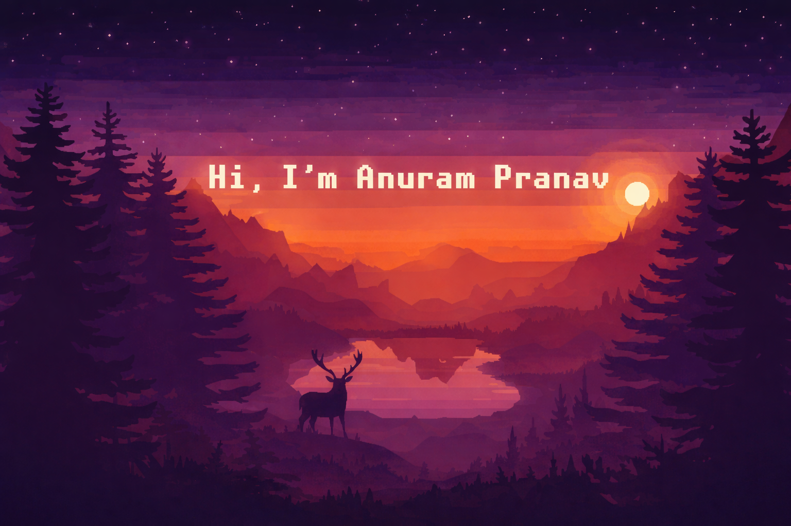

  

<h1 align="center">Hi 👋, I'm Anuram Pranav</h1>
<h3 align="center">💻 networking Mindset | 🚀 Developer | 🤖 AI Enthusiast</h3>

---

## 🚀 About Me
- 🎓 Student passionate about tech & real-world projects  
- 🧠 Learning **DSA, AI/ML, and Full Stack Development**  
- ⚡ Building projects like **YouMatter (Hackathon Project)**  

---

## ⚙️ Tech Stack

  

---

## 📊 GitHub Stats

  
  

---

## 📈 Most Used Languages

  

---

## 🔥 Contribution Graph

  

---

## 🧠 Coding Profiles
- 💡 LeetCode: *Add your link here*
- 🏆 Codeforces: *Add your link here*

---

## ⚡ Fun Fact
> “I don’t just use technology, I build it.” 🚀
