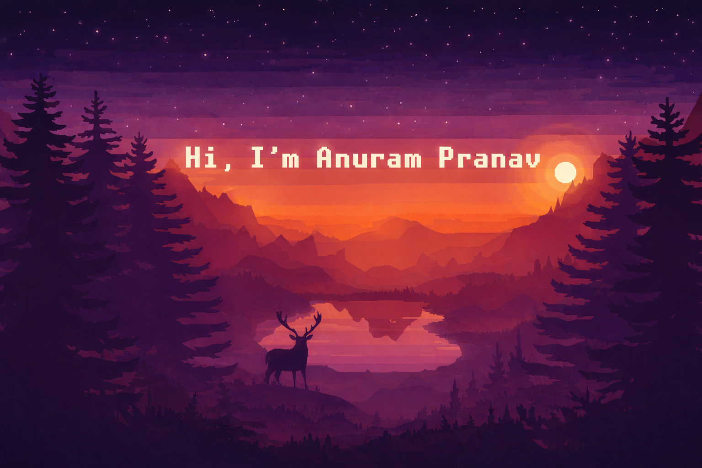

<div align="center">



<br>

# ⚡ ANURAM PRANAV

### `BUILDING • BREAKING • LEARNING • REBUILDING`


<br><br>

<a href="https://github.com/Anurampranav">

</a>

<a href="https://www.linkedin.com/in/anuram-pranav">

</a>

</div>

---

## 🧬 `whoami`

```text
┌──────────────────────────────────────────────────────────┐
│                                                          │
│  NAME       →  Anuram Pranav                             │
│  ROLE       →  Student Developer / Builder              │
│  FIELD      →  Computer Science                         │
│  UNIVERSITY →  JSS Science and Technology University    │
│                                                          │
│  I don't just learn technologies.                        │
│  I try to build things with them.                       │
│                                                          │
└──────────────────────────────────────────────────────────┘
```

> `curiosity → experiment → failure → debugging → solution`

---

## 🛰️ CURRENTLY BUILDING

<table>
<tr>

<td width="50%">

### 🛡️ AI Guardian

AI-powered emergency detection system designed to analyze CCTV footage and detect potentially dangerous situations in real time.

**Stack**

`YOLOv8` `OpenCV` `PyTorch`
`FastAPI` `React` `WebSocket`

</td>

<td width="50%">

### 🌱 Smart Irrigation

Exploring IoT + automation to create smarter agricultural systems using real-time environmental data.

**Focus**

`IoT` `Sensors` `Automation`
`Smart Agriculture` `AI`

</td>

</tr>
</table>

---

## ⚙️ TECH STACK

### `LANGUAGES`

<p>

</p>

### `WEB & BACKEND`

<p>

</p>

### `AI / DATA / DATABASE`

<p>

</p>

### `TOOLS`

<p>

</p>

---

## 🧠 `WHAT I'M INTO`

```text
AI / ML              ███████████████████░░   90%
Backend Development  █████████████████░░░░   85%
Web Development      ████████████████░░░░░   80%
IoT / Automation     ██████████████░░░░░░░   70%
Computer Science     ███████████████████░░   90%
Photography          ███████████████░░░░░░   75%
```

---

## 🧪 PROJECT LAB

| PROJECT                      | WHAT IT DOES                    |   STATUS   |
| :--------------------------- | :------------------------------ | :--------: |
| 🛡️ **AI Guardian**          | AI-powered emergency detection  |  `ACTIVE`  |
| 🌱 **Smart Irrigation**      | IoT-based irrigation automation | `BUILDING` |
| 💙 **YouMatter**             | AI-focused wellbeing platform   | `BUILDING` |
| 🚗 **Vehicle Rental System** | Full-stack rental management    |    `DEV`   |
| 🌦️ **Weather Station API**  | Weather API using FastAPI       |   `DONE`   |

---

## 📊 GITHUB TELEMETRY

<div align="center">


</div>

<br>

<div align="center">


</div>

---

## 🐍 CONTRIBUTION MATRIX

<div align="center">


</div>

---

## 📡 ACTIVITY SIGNAL

<div align="center">


</div>

---

## 📸 OUTSIDE THE CODE

> `Photography is where I slow down.`
> `Programming is where I speed up.`

When I'm not debugging something, you'll probably find me behind a camera,
exploring technology, working on a project, or trying to turn another random
idea into something real.

---

## 🎯 2026 MISSION

```diff
+ Build more real-world projects
+ Go deeper into AI & backend engineering
+ Participate in more hackathons
+ Contribute to open source
+ Improve system design
+ Ship > Perfect
```

---

<div align="center">

### `IF YOU FOUND SOMETHING INTERESTING HERE, SAY HI.`

<br>

<a href="https://www.linkedin.com/in/anuram-pranav">

</a>

<br><br>


<br><br>

`© 2026 Anuram Pranav`

</div>
